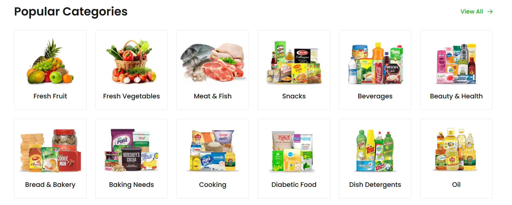
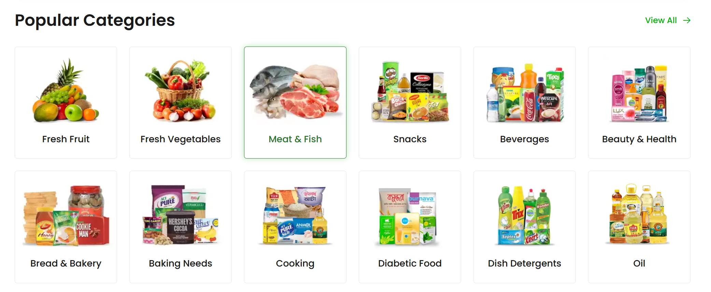
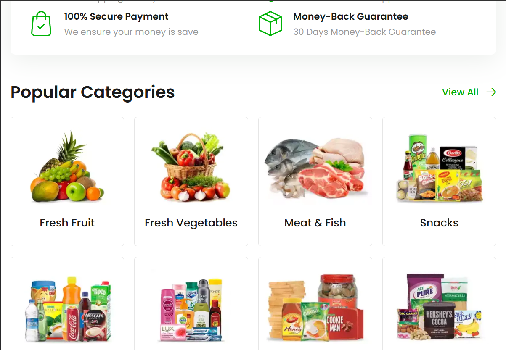
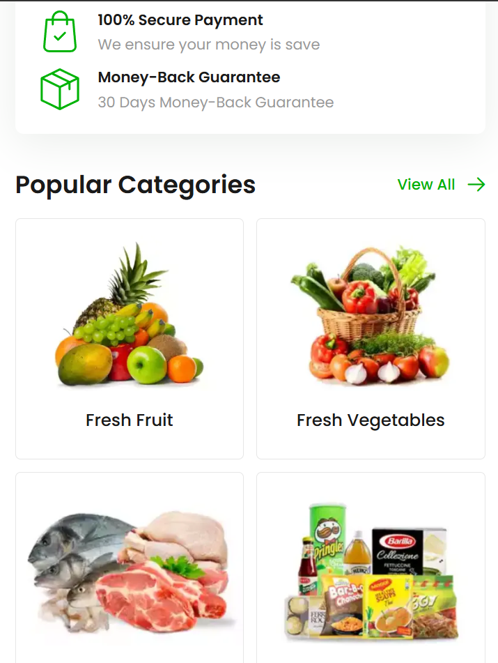
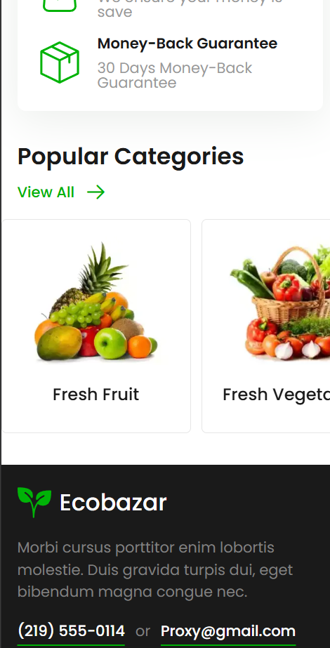
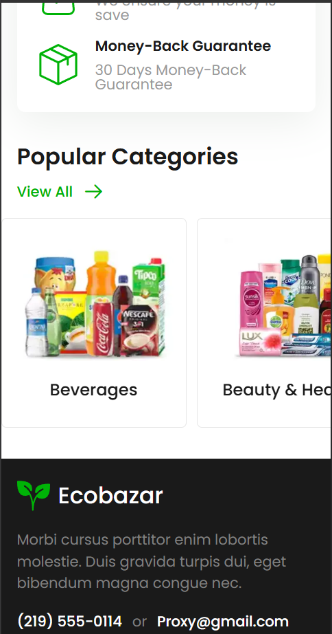

# Ecobazar — E-commerce Layout

Responsive e-commerce website layout built with **HTML5**, **SCSS** and **vanilla JavaScript**.  
Project focuses on clean semantics, BEM architecture, adaptive layout and production-like Git workflow.

---

## Tech stack

- **HTML5**
  - semantic markup
  - accessibility-friendly structure
- **SCSS**
  - BEM methodology
  - mixins
  - adaptive typography
  - clamp-based responsive values
- **Vanilla JavaScript**
  - mobile menu interactions
  - touch device handling
  - dynamic header behavior with `matchMedia`
- **Git**
  - feature branches
  - squash & merge workflow
  - clean commit history

---

## Implemented Sections

### Hero Section
- CSS Grid layout
- Adaptive image cropping via `object-position`
- Multiple content card types
- Fully responsive from desktop to mobile

### Benefits Section
- Grid-based layout
- Icon + text alignment
- Adaptive wrapping and spacing

### Popular Categories Section
- Responsive CSS Grid
- Hover & focus-visible states
- Mobile behavior:
  - 2 columns on medium screens
  - Horizontal scroll slider without JS on small screens
  - Touch-friendly overflow scrolling

---

## Responsive Screenshots

### Desktop

**Grid layout**

**Hover state**

---

### Tablet

---

### Mobile

**Two-column layout**

**Horizontal scroll (start)**

**Horizontal scroll (middle)**

---

## Features

- Fully responsive layout (320px → 1920px)
- Adaptive typography via SCSS mixins
- Accessible interactive states (`:hover`, `:focus-visible`)
- Touch-friendly UI
- Slider-like behavior without JS using `overflow-x`
- Clean BEM-based component structure

---

## Project structure
src/
├── css/
├── js/
├── scss/
├── img/
├── screenshots/
│ ├── desktop/
│ ├── tablet/
│ └── mobile/
├── index.html
└── README.md

---

## Status
Work in progress 🚧  
Currently implemented: header, hero, benefits, popular categories, footer, base layout system.

---

## Author
Frontend layout project for portfolio purposes.  
Focus: modern CSS, responsive design, clean architecture and real-world Git workflow.